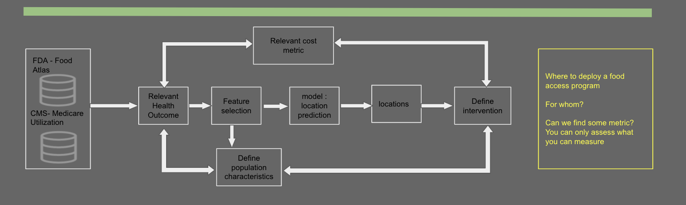

# food_access: Analysis of food insecurity in USA

Project Summary: The aim of these preliminary analysis is to address food access challenges using publicly available data. 

### Why is this important? 
There is substantial research linking poor nutrition with poor health outcomes. This is particularly true in patients with chronic diseases such as diabetes or heart disease. Poor nutrition is caused not only for the lack of food but for the excess of unhealthy food that leads to obesity which leads to other health problems. The aim is to address questions such as:

- Where should a food access program be deployed?
- Which segment of the population might benefit the most from the program?
- What do we know about potential impact on medical costs or utilization?

### Cant't be that bad....

The datasets include information at the county level about more than 500 variables. Those variables are related to access to food stores, access to food programs, poverty level, diet-related conditions (diabesity = diabetes and obesity), race distribution, and many medicare related variables.
The analysis was centered on the health outcomes diabetes and obesity as a main indicators. Those indicators were used to address questions of where, who and also to predict general economical impact on medical expenses. I GOT THIS!!

### Requirements
The main requirements are listed below:

- Python 
- Numpy
- Scikit-Learn
- Matplotlib

others:
- Pandas
- Jupyter Notebook

#### Data

The datasets were constructed from:

- FDA – Food Atlas - https://www.ers.usda.gov/data-products/food-environment-atlas/data-access-and-documentation-downloads/

- CMS – State/County Medicare Utilization Summary - https://www.cms.gov/Research-Statistics-Data-and-Systems/Statistics-Trends-and-Reports/Medicare-Geographic-Variation/GV_PUF 

 
#### Notebooks

- data_preprocesing_food.ipynb data loading and reduction of Food Atlas data
- data_preprocesing_cost.ipynb data loading and reduction of Medicare data
- food_acccess.ipynb data loading, cleaning, exploring and modeling.

## Pipeline
### Pre-processing 
Both datasets containg > 250 variables per county in USA. The first step is load the data to be merged in a unique csv file. This process can be optimized by loading the data to sql database and fetched directly. 
### Exploration
Some variables are skewed and some may have artifacts. If we are looking at the extremes (i.e. high negative outcome) we may decide to examine the outliers. 
In this case, the data I wanted to use as a predictor (obesity and diabetes) were not very granular. 
### Correlation and Modeling
My working approach was using those variables look for variables related to socioeconomic factors, access to food, race... at the county level. 
Select those features that could predict obesity/diabetes. 
### Predict county locations 
The correlations will be used to scale each relevent variable value using mask to aply weigths according to client relevance.
### Infer medical cost
Infer medical costs by correlating the predictors to Medicare relevant numbers. The choices I made didn't seem to be the appropiated to answer that question. 

## Summary 
Where should we deploy a food access program?
There seems to be a correlation between low acccess to food stores, low income, and race (african-american). The program could target food deserts and promote increase access to healthy food.

Which segment of the population might benefit the most from the program?
For those living in food deserts - low access to food store- any racial group sems to be affected.
For specific populations like low income an poverty level some racial groups seem to be more affected. 

I didn't get to estimate the impact on the medical costs. My approach may be correlate level of predictor with hospitalizations. Then correlate the predictor with a variable that can be estimated such us SNAP participants. 

