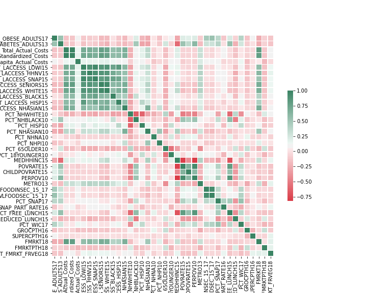

# Analysis of food insecurity in USA

Project Summary: The aim of these preliminary analysis is to address food access challenges using publicly available data. 

### Why is this important? 
There is substantial research linking poor nutrition with poor health outcomes. This is particularly true in patients with chronic diseases such as diabetes or heart disease. Poor nutrition is caused not only for the lack of food but for the excess of unhealthy food that leads to obesity which leads to other health problems. The aim is to address questions such as:

- Where should a food access program be deployed?
- Which segment of the population might benefit the most from the program?
- What do we know about potential impact on medical costs or utilization?

### Cant't be that bad....

The datasets include information at the county level about more than 500 variables. Those variables are related to access to food stores, access to food programs, poverty level, diet-related conditions (diabesity = diabetes and obesity), race distribution, and many medicare related variables.
The analysis was centered on the health outcomes diabetes and obesity as a main indicators. Those indicators were used to address questions of where, who and also to predict general economical impact on medical expenses. 

I GOT THIS!!

-------------------------------------------------------------------------

## Pipeline: EXPLORATORY PHASE

### Pre-processing 
Both datasets containg > 250 variables per county in USA. The first step is load the data to be merged in a unique csv file. This process can be optimized by loading the data to sql database and fetched directly. 
### Exploration
Some variables are skewed and some may have artifacts. If we are looking at the extremes (i.e. high negative outcome) we may decide to examine the outliers. 

In this case, the data I wanted to use as a predictor (obesity and diabetes) were not very granular. 

### Correlation and Modeling
My working approach was using those variables look for variables related to socioeconomic factors, access to food, race... at the county level. 
Select those features that could predict obesity/diabetes. 

### There are many interesting relationships

Food access is not only a socioeconomic issue but it is a racial equality one.

**** NOTE: THIS IS MORE COMPLEX THAT ANTICIPATED (?!!!)

### Model to Predict county locations 

The correlations will be used to scale each relevent variable value using mask to apply weigths according to a pre-defined criteria of relevance*. In this case I focused on the variables that had an strong relatioship with prevalence of diabetes/obesity. I used bining to assign an score based on the 
quantile distributions. 
Every county will have assigned a risk score ['lowest (<6)', 'low (6-10)', 'high (10-12)', 'highest (12-15)']. 

This risk score will be analyzed against all the other features to characterize the different groups.

*)With this choice of parameters I am already introducing bias. 

## Geographical locations

The counties with the higher score could be proposed as a condidates for the intervention.

### Infer medical cost

Infer medical costs by correlating the predictors to Medicare relevant numbers. 

-------------------------------------------------------------------------

## Summary 

#### Where should we deploy a food access program?
A food access program could target locations with high percent of population that has low income and low access to stores. We should look into comunities with high number of households that do not own a car and have low access to stores. 
The type of intervention could take advantage that those clocations tent to have lower number of farmer's markets and are in areas with low ration metro/nonmetro.
In addition those comunities have been already identified of having greather percent of housholds elegible for SNAP but where the program is not having the desired reach.

#### Which segment of the population might benefit the most from the program?
It seems that targeting families with school age kids from underserved comunities - African-American - have the potential of having a huge impact.   

The program could target (healthy-)food deserts, use school as a vehicle for reach children and promote comunity access to healthy food.

### What do we know about potential impact on medical costs or utilization

To estimate the impact on the medical costs one possible approach could be correlate level of predictor with hospitalizations with affects medical cost. Then correlate the predictor with a variable that can be estimated such us increase of SNAP participants. 

-------------------------------------------------------------------------
## Pipeline: 

-------------------------------------------------------------------------
## Requirements, Data Sources & Notebooks

### Requirements
The main requirements are listed below:

- Python 
- Numpy
- Scikit-Learn
- Matplotlib

others:
- Pandas
- Jupyter Notebook

#### Data

The datasets were constructed from:

- FDA – Food Atlas - https://www.ers.usda.gov/data-products/food-environment-atlas/data-access-and-documentation-downloads/

- CMS – State/County Medicare Utilization Summary - https://www.cms.gov/Research-Statistics-Data-and-Systems/Statistics-Trends-and-Reports/Medicare-Geographic-Variation/GV_PUF 

 
#### Notebooks

- data_preprocesing_food.ipynb data loading and reduction of Food Atlas data
- data_preprocesing_cost.ipynb data loading and reduction of Medicare data
- food_acccess.ipynb data loading, cleaning, exploring and modeling.
- food_acccess_model.ipynb data loading, cleaning, exploring and multivariable modeling for feature selection
